# Games R us

# IM I RESPONSIVE ()

### Games R us is an ecommerce web application for customers seeking to purchase pc gaming accessories online.

This is the fifth and last portfolio project for the Code Institute Diploma in Fullstack Software Development.

Users can create accounts and administrators have full write and delete access to all data. To test an administrator account, 

You can test the card payment functionality without making a purchase. Use card details:

4242 4242 4242 4242 - CVC and 5-number postal code at the end of the card can be any numbers.

### Admin:

* password: Niklas3000
* Username: Admin

You can view the deployed site 
[Link to Live Website](https://gamesruz.herokuapp.com/)

Github repo 
[GitHub Repo](https://github.com/ejkington/gamesrus)

# Project Overview
Games R Us is an assignment for the Code Institute Diploma in Full Stack Software Development, but also meant to be applicable in a real world scenario (except for the products being fictional of course).

The focus points for this application are ecommerce, using the Django framework and the ability to go through with a payment for an order.

## Agile Workflow

I have tried to implement the basic Agile strategy

I used github for userstories and a separete file and used the github kanban board
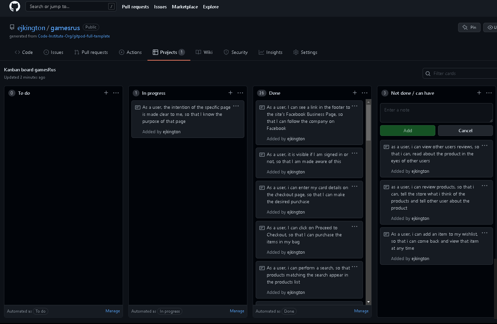

I have tried to implement the basic Agile strategy, creating issues for my user stories, a Kanban board for the project.

# User Experience
## Strategy
## Primary Goals
The site owners primary goals are:

* To be able to sell the stores products online

* To have the ability to add, remove or edit products in the store

* To access a customers order, edit and/or remove it if necessary

* To access and keep track of customer information

* To own a website which is easy to use and navigate, for all types of users on all devices.

### A potential customers primary goals are:

* To be able to view details of and purchase any of the available products from the online store.

* To be able to register for an account

* To see an order history in their account

* To be able to edit their account details or remove their account

* To easily navigate the whole website and keep track of all user interactions, for example the products in their cart and how much they are to spend

# Business Model
I have chosen a traditional B2C (Business to Customer without middle person) application, which has a straightforward and user friendly interface. This online store offers no products of their own and relies on the wholesale of branded products. A real world version of the store would list all the retailers it is affiliated with.

The business flow is as follows:

* Games R Us buys products from wholesale retailers or from the manifacturers themselvse

* The website handles selling of products from Games R Us to the end customer, the website user.

The intentions should be obvious and users should know as soon as they enter the site what it offers and how to use it's features.

### Marketing
This site has a Facebook Business page with a link on the page footer. It can be viewed
# (LINK TO FACEBOOK SITE)

### Search Engine Optimisation

I have also done some research on highest searched words in Gaming retailing, and came up with this title and description:

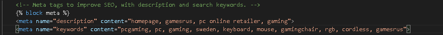

# Structure
This website has 11 custom built pages and 16 (not all are used) account operations Django Allauth pages. The navbar at the top of the screen gives users access to the most important pages at all times.

## Pages
### Accessible to all users

* Home - The landing page of the site, with a full screen carousel hero image giving first time visitors a nice welcome

* Products - This is a list of the products when clicking on a category in the navbar, or performing a search

* Product Detail - The dedicated page for a specific product, where users can read a description and perform all given tasks for the product

* Bag - A user purchases an item by adding it to the bag; clicking on it will show all bag items

* Checkout - Here users enter their delivery details and card info to proceed with their order

* Order Confirmation - The page show when a payment has successfully been made, showing the order information

* The Sign In and Sign Up pages

## Accessible to signed in users

### Profile page 

* The users order history, billing and shipping info is here.

#### Sign Out

* Other accounts operations pages such as Change Password or Password reset

* Delete Account - Allows the user to completely remove their account from Games R us

### Accessible to Admin users

* Add Product - This is where admin users can add new products to the website

* Edit Product - The page for admins to edit or delete products

* Manage products - An overview of all products on the site with edit and remove functionality

* In the django admin, admins can further. Add new products, categories, view orders made, and manage signed up users

## Pages provided by Django
These pages are provided by the Allauth package of the Django framework, but are customised by me to fit in with the rest of the site. Read more about Allauth here

* Sign Up - where users can register for an account on the site

* Sign in - Registered users can log accessing their personal info etc by signing in

* Sign Out - The same goes for signing out

* Various pages for email verification and password reset, etc

## Technical Design
###Code Structure
I have devided the code into apps as per Django best practice, for the different areas of functionality.

* Home - basic functionality for the home page

* Products - all functionality related to the products on the site

* Bag - functionality for the users shopping bag

* Checkout - functionality for the user to go through with the order and payment

* Profiles - functionality regarding the users profile and order data

* User Account - The app in which users can delete their account

### Other Directories and files

* static - css and javascript files

* media - images for the development website (other images are used in the production version)

* gamesrus - project folder containing settings, urls and other configuration files for the whole project

* templates - contains the base template and templates (HTML-files with Django logic) for the Django allauth authentication

* manage.py - the main python project file to get the web application running

* README.md - the document you are reading right now, documentation of the whole project

* custom_storages.py - configuration for storage of media and static files on AWS S3

Enviromental Variables such as API-keys, passwords etc are stored securely in the back end (in the development environment and in the Heroku App settings) so that regular users do not have access to them.

* Procfile - needed for deployment to Heroku to specify commands to be executed by the app on startup

* requirements.txt - a list of dependancies (installed packages) that the project requires for the application to function

## Database

The SQLite database was used for the development environment, and the Postgres database for production as an add-on via Heroku. Both are relational databases and work well with the Django framework used for this project.

## Data Models
The following models have been used to populate the database and for the site to function as it should:

* User - the built in Django User model, facilitates the users basic information

* Category - the category in which the product is placed

* Product - the model for the product itself and its details

* Order - a users successful purchase leads to an instance of the Order model being created, storing delivery and user data

* OrderLineItem - a model holding the product information for a single product, binding the product model together with the order

* UserProfile - the model storing the users product and order information

# Img of database schema for models (#)

## Scope - Epics and User Stories
Epic 1: Base functionality and ease of use
As a user, the intention of the specific page is made clear to me, so that I know the purpose of that page

As a user, I can access important links such as home, products, my bag, sign in/out, and my profile by scrolling and/or clicking once, regardless of where on the site * I am, so that i can easily navigate the site

* As a user, I can see a link in the footer to the site’s Facebook Business Page, so that I can follow the company on Facebook

* As a user, it is visible if I am signed in or not, so that I am made aware of this

* As a user, the choices I make on the site are confirmed to me, so that I am always aware of them

## Epic 2: Products
* As a user, I can browse a list of products for sale on the site so that I can find the product I seek

* As a user, i can perform a search, so that products matching the search appear in the products list

* As a user, I can sort the products list by category, alphabetically or by rating, so that i can quickly find the product I seek

* As a user, I can view the most important details of the product in the product list, such as category, price, rating, and image so that i know most details without having to click on the product

* As a user, i can click the product in the products list so that I can view the products details

## Epic 3: Bag
* As a user, I can add a product to my bag by clicking ’Add to bag’ from the product detail page so that I can purchase the product

* As a user, I can always see the total price of my bag in the navigation bar, so that I know what the total cost will be

* As a user, i can adjust the quantity of the product chosen after adding it to the shopping cart in the order details

* As a user, I can view the products added to my bag by clicking the bag icon or by adding an item to the bag

* As a user, I can update the quantity or remove it completly

## Epic 4: Checkout
* As a user, I can click on Proceed to Checkout, so that I can purchase the items in my bag

* As a logged in user, on the Checkout page, I can choose to save my delivery address to Profile if logged in, so that I can retain it for future orders

* As a user, i can enter my card details on the checkout page, so that I can make the desired purchase

* As a user, I am informed of whether my purchase was successful or not via the Order Successful page, as well as via an email sent upon order confirmation

## Epic 5: User registration and account
* As a user, I can register for an account on the site, so that I can gain all the site’s customer benefits

* As a user, I am not able to access pages that require authentication if I am not signed in

* As a user, I have to confirm my email address to complete my account registration

* As a logged in user, i can view a My profile page, so that I can view my previous orders, and view and update my delivery and contact details

* As a logged in user, I can add my delivery details to the profile page, so that it is my default delivery address for my order on the checkout page

* As a logged in user, I can choose to delete my account, so that my user account no longer exists

## Epic 6: Site Owner functionality
* As a site owner, I can view an admin page, where I can perform batch editing of model instances on the site including products, categories, orders

* As a site owner, I can add, edit or remove any product on the site

* As a site owner, I can remove any products review on the site

# Existing Features 

Feature 1: The Navbar
The navbar allows users to easily navigate the website, no matter which page they are on. The navbar consists of:

* The products navigation menu, with sorting or filtering possibilities
* A search bar, displaying results based on product name
* A Sign In/Sign Up icon
* Bag

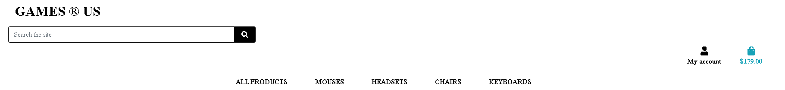
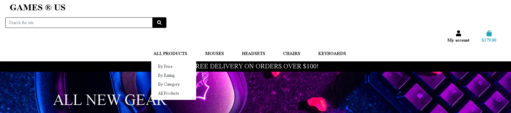

If the user us logged in, the Sign Up/Sign In menu becomes the Account menu, and if the user has admin privileges the user can access the manage brands an add product or brand pages through here.

There is a floating badge in the top right corner displaying the grand total and item count, always visible of the user scrolls up, that turns light green if items are added or in the bag,

## User stories covered

As a user, I can access important links such as home, products, my bag, sign in/out, and my profile by scrolling and/or clicking once, regardless of where on the site I am, so that i can easily navigate the site

* As a user, it is visible if I am signed in or not, so that I am made aware of this

* As a user, the choices I make on the site are confirmed to me, so that I am always aware of them

* As a user, i can perform a search, so that products matching the search appear in the products list

* As a user, I can always see the total price of my bag in the navigation bar, so that I know what the total cost will be

* As a user, I can view the products added to my bag by clicking the cart icon or by adding an item to the cart

* As a user, I am not able to access pages that require authentication if I am not signed in

# Feature 2: The Landing Page
The home page is the landing page of the site, with the purpose to entice the user to proceed to the products.

The user is presented with a window-sized (half window on tablet/mobile) With a pink neon button that goes directly to all products.

## User stories covered:

* As a user, the intention of the specific page is made clear to me, so that I know the purpose of that page

* As a user, I can access important links such as home, products, my bag, sign in/out, and my profile by scrolling and/or clicking once, regardless of where on the site I am, so that i can easily navigate the site

* As a user, the choices I make on the site are confirmed to me, so that I am always aware of them

# Feature 3: The Footer
The footer includes a link to the site's Facebook business page and a button to go to all products,  Wherever the user is on the site, except for some account operations, the footer is visible at the bottom of the page, giving the user access to these important links at virtually all times.

## User stories covered:

As a user, I can see a link in the footer to the site’s Facebook Business Page, so that I can follow the company on Facebook

As a user, I can quickly go to all products via the button

As a user, I can see the copyrights of the page

# Feature 4: The Products List
The products list is dynamic and will show the relevant products, depending on if the user has performed a search, clicked on a category or filtered the products in any other way.

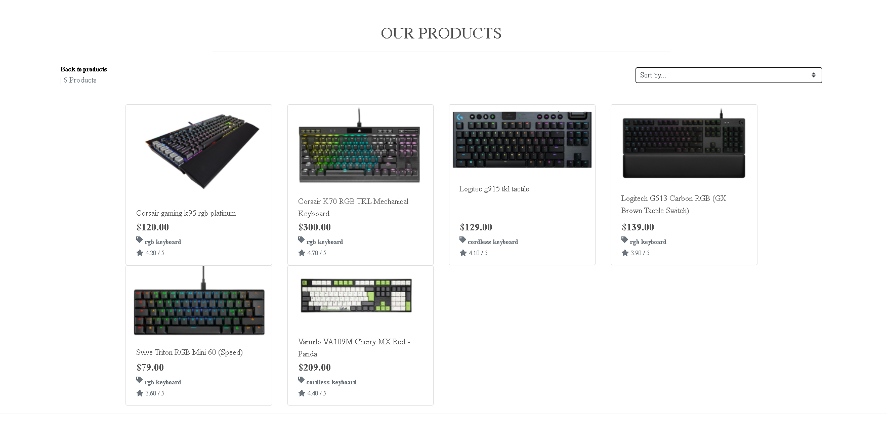
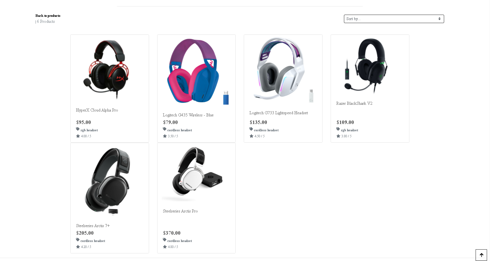

Filtering can be done:

By category
By rgb
By cordless
By users performing a search
On top of this, sorting can be done by price, rating, name or category. 

In the products list, the most important details of each item are displayed; name, category, price, and of course the product image. For admin users. the edit and delete buttons are also visible here.
User stories covered:

## User stories covered:

As a user, I can browse a list of products for sale on the site so that I can find the product I seek

As a user, i can perform a search, so that products matching the search appear in the products list

As a user, I can sort the products list by category, alphabetically or by rating, so that i can quickly find the product I seek

As a user, I can view the most important details of the product in the product list, such as model, category, price, rating, and image so that i know most details without having to click on the product

# Feature 5: The Product Detail Page
This page shows a dedicated page for the specific product. Here users can choose the quantity of the product, as well as read a description and see the products rating.

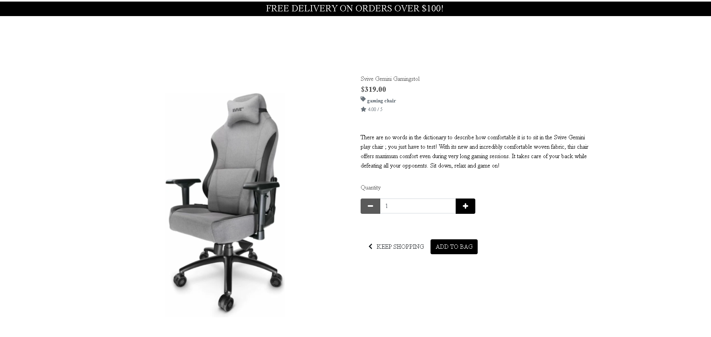

Here users can decide the quantity to be added to their bag.

Admin users can edit and remove the product through links here.

## User stories covered:

As a user, i can click the product in the products list so that I can view the products details

As a user, I can choose the quantity, so that I can purchase the correct quantity

As a user, I can choose to checkout or to keep shopping, the bag is saved in the session

As a user, I can see the price, category, image and rating of the product 

## Feature 6: The Bag
The Bag is the users digital shopping bag, containing all products the user has added to it and their details.

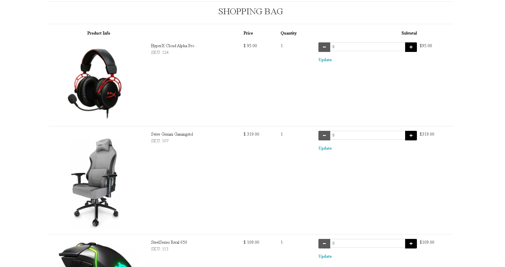

Its grand total and count is always partially visible in the navbar but has a dedicated page through which users can go through with the payment when they are done shopping.

A toast, a small dialog window at the top right, will be visible after adding an item to the bag, letting the user know that the add was successful. The user can view, change quantity and remove items from the bag on the bag page.

## User stories covered:

* As a user, I can add a product to my bag by clicking ’Add to Bag’ from the product detail page so that I can purchase the product

* As a user, I can always see the total price of my bag in the navigation bar, so that I know what the total cost will be

* As a user, i can adjust the quantity of the product chosen after adding it to the shopping bag

* As a user, I can view the products added to my bag by clicking the bag icon or by adding an item to the 

* As a user, I can click the update button, so that I can easily remove or increse quantity products from my bag

## Feature 7: The Checkout Page
The checkout page features a form for the user to fill in, with name, email, phone number, delivery address and card details.

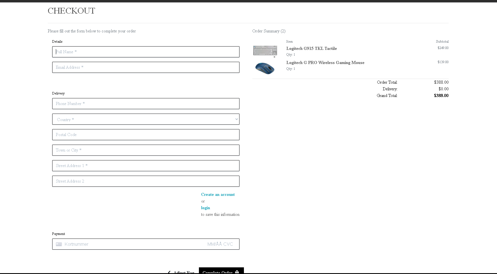

From the checkout page, if user is authenticated, they can save their details to their their profile so they are prefilled for the next order. If they are not logged in, a link to log in is displayed in place of that option.

If the payment fails or info is sufficient, the user gets a new chance to enter their info, without being charged.

## User stories covered:

As a user, I can click on Proceed to Checkout, so that I can purchase the items in my bag

As a logged in user, on the Checkout page, I can choose to save my delivery address to my profile, so that I can retain it for future orders

As a user, i can enter my card details on the checkout page, so that I can make the desired purchase

## Feature 8: The Order Successful Page
If the user has made a successful purchase, an order confirmation will be displayed to the user, and sent to the given email address during checkout. If the order was successful, the bag will be emptied

In the confirmation, the user can view the items order, their quantity, an order number, grand total and delivery details.
While the site is loading the information an overlay is shown to show the user that the site is loading

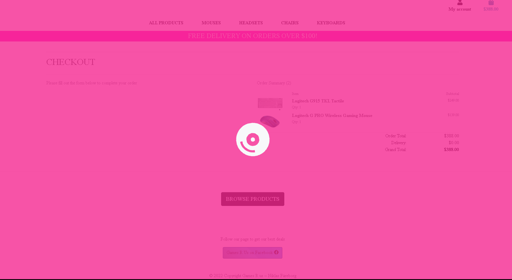

## User stories covered:

As a user, I am informed of whether my purchase was successful or not via the Order Successful page, as well as via an email sent upon order confirmation

## Feature 9: The Sign Up/In/Out Pages
Signing up, in and out are vital parts of this site, allowing users to save customer details to improve the users experience of the site. It also creates a possibility for the site owner to gain revisiting customers.

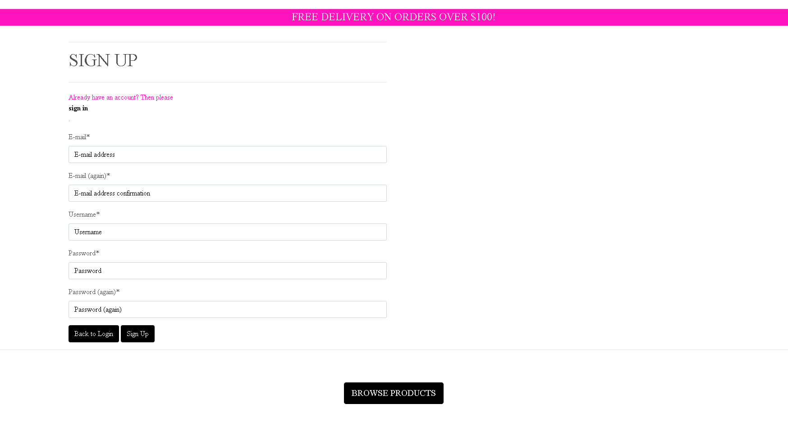
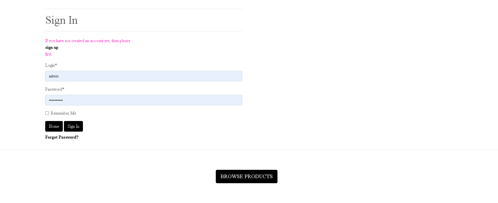
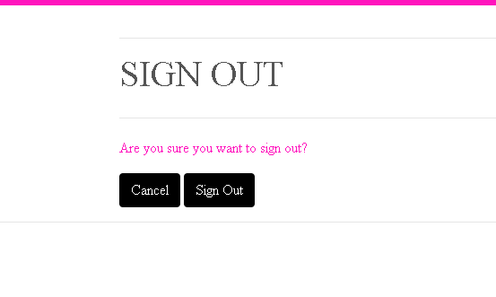

Users can easily sign up through the link in the navbar.

As users browse the site, they will see various links to sign in to access functionality saving delivery details

Upon registration, the site sends an email to confirm the users email address. They then can sign in to the site and access their profile and all other functionality for signed in users.

## User stories covered:

As a user, I can register for an account on the site, so that I can gain all the site’s customer benefits

As a user, If I am not signed in, I am redirected to sign in/up if I click on any of the links or buttons restricted to logged in users

As a user, I have to confirm my email address to complete my account registration

## Feature 10: My StepUp
Each user can access their own personal profile where they can enter their delivery information and keep track of their orders.

Here, users can also change contact and delivery information

### User stories covered:

* As a logged in user, i can view a My profile page, so that I can view my previous orders, and view and update my delivery and contact details

* As a logged in user, I can add my delivery details to the My profile page, so that it is my default delivery address for my order on the checkout page

## Feature 11: The Admin Features

There are extra features for admin users, so that site owners can add, edit and remove products on the site. This is visible in the navbar, where two more items are visible in the account menu; Product managment

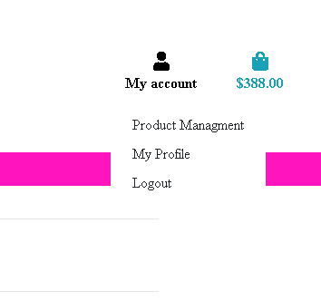

It is also visible in the products pagem Edit and Remove buttons on each product card in the list. On the product detail page, the Edit and Remove buttons are also visible.

The Edit Product page consists of the same product form as on the previously page, only already filled out with the products current information. Here the admin user can update any current info for the product, as well as change the product image.

* As a site owner, I can add, edit or remove any product on the site

## Feature 12: The Django Admin
The Django framework provides an excellent admin interface which this site has taken full advantage of. The admin panel of this site contains all instances of all database models, and the ability to edit, remove or add instances.

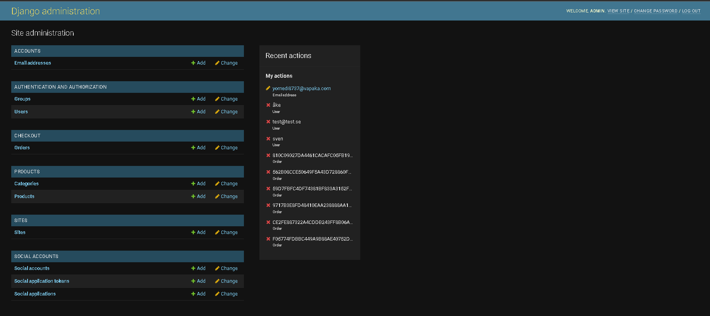

### User stories covered:

As a site owner, I can view an admin page, where I can perform batch editing of model instances on the site including products, categories and orders

## Technologies Used

### Languages

* [Python](https://www.python.org/) - was used for backend programming

* [html5](https://en.wikipedia.org/wiki/HTML5) - was used for building all web pages

* [CSS3](https://en.wikipedia.org/wiki/CSS) - was utilized for styling the website

* [JS](https://en.wikipedia.org/wiki/JavaScript) - for frontend programming

### Frameworks, Libraries and Other Resources

This project is built solely through the framework [django](https://www.djangoproject.com/), and I have tried to make use of its many powerful features.

I have used [bootstrap4](https://getbootstrap.com/) as a framework for styling for efficiency purposes.

The JavaScript framework [JQuery](https://jquery.com/) was used to minimize written code.

[Font Awsome](https://fontawesome.com/) fonts were used for all icons in this project.

[Google Fonts](https://fonts.google.com/) - Were used for all fonts in this project.

[Facebook Pages](https://www.facebook.com/pages/create/?ref_type=site_footer) was used to create the Facebook Business Page that is linked on the site.

[Git](https://git-scm.com/) - Version control system used to commit and push to Github via Gitpod.

[GitHub](https://github.com/) - The projects repository and all its branches were commited, and pushed to Github.

[Heroku](https://dashboard.heroku.com/) - Used to deploy the application.

[AWS S3 Bucket](https://aws.amazon.com/s3/) - Used to host media (images) and static(CSS and JavaScript) files for the site.

[Stripe](https://stripe.com/se) - Used to process the users payments and handle webhooks.

[Gitpod](https://gitpod.com/) - All code was written and tested with the Gitpod web-based IDE.

[LucidChart](https://lucid.co/product/lucidchart) was used to create the visual model schema of the project.

## Testing

Thorough testing of the site was performed

## Manual testing

### Overview

I have tested the features against their user stories that cover them.

### Testing of user story 1:

As a user, the intention of the specific page is made clear to me, so that I know the purpose of that page

This test is difficult to document, as it is covered by all the features and pages.

* Conclusion: tests passed

#### The Products Page

* Intention: display the list of products according to the users query

The user can filter results by search query, clicking on RGB, Cordless, All Products or sort the products by name, category, price or rating.

* Conclusion: tests passed

#### The Product Detail Page

Intention: display the relevant information for the product in a tasteful manner and making it easy for the user to add the product to their bag

The displayed information of the product is the SKU nr, name, category, description, details, price, giving me enough info to make my decision if the product falls to my liking.

The quantity controls are easy to understand, and adding to the bag is done by clicking once on the button in question.

* Conclusion: tests passed

#### The Bag Page

Intention: to show the user an overview of what the user intended to buy so the user can adjust the quantity, proceed to checkout or continue browsing

The user has a clear overview of the bag wherever they are on the site, thanks to the floating grand total and product count at the top right or middle of screen on smaller screens.

Going to the page, the user can clearly see the intention of the page. The count of items is at the top together with the page title. All items are visible as a table, including their image, name, SKU nr and price as well as fields where the user can adjust the quantity and remove the item from the bag. The grand total here is written in large fonts, and the buttons are large too.

The quantity controls are easy to understand, and adding or removing to the bag is done by clicking once on the button.

* Conclusion: tests passed

#### The Checkout Page

Intention: Allow users to enter the needed information for them to purchase the items in their bag

The Checkout Page is clear and simple, and contains the fields:

* Full Name
* Email Address
* Phone Number
* Street Address 1
* Street Address 2
* Town or City
* Postal Code
* Country
* Card Details

As well as the Order summary, including the items added to the bag, their name, quantity and price. The Grand total is very visible at the bottom of the page.

Under the card details field, the grand total amount is displayed once more in red.

This to me is very clear, implying that after this step, the order is processed.

* Conclusion: tests passed

### The Sign Up/Sign In/Sign Out Pages

Intention: Allow users to sign up, in or out

The Signup/Login form is easy to understand and gives clear indications on whats needed.
If the users inputs a invalid form the user will not be able to proccess the form and is prompted to try again with valid information

* Conclusion: tests passed

The Profile Page

Intention: To give the user a way to personalize their experience on the site, as well as a reason to return

As the Profile page includes info that the user themselves have chosen, Showing the order history and if saved information box was checked on checkout the information is here aswell, the user can edit delivery information if the user wants too

* Conclusion: tests passed

### The Product Managment Page

Intention: Allow admin users to add a product to the site

This page is also rather clear with one form on the page, the image file is displayed if a file is chosen and, with the click of a button at the bottom, the new product is visible just like all the other ones in the Products or Manage Brands pages.
the admin can choose what category, name, description etc

* Conclusion: tests passed

#### The Edit Product Page

Intention: Allow admin users to edit a product on the site

The Edit Product page, just like the Product page, has a form in which the fields are clear to the user. The user can see the current product details, edit them and is prevented from entering false information, important details, like the description, details or name etc

* Conclusion: tests passed

## Testing of user story 2:

As a user, I can access important links such as home, products, bag, sign in/out, and profile by scrolling and/or clicking once, regardless of where on the site I am, so that i can easily navigate the site

The navbar is present throughout the site. I have chosen to include the navbar in the authentication pages (sign up/in/out) if the user should wish to access them.

* Conclusion, User story 2 - : tests passed

## Testing of user story 3 and 4:

As a user, I can see a link in the footer to the site’s Facebook Business Page, so that I can follow the company on Facebook

Like the navbar, the footer, includes the Facebook pages link, is almost always visible on each page. 

* Conclusion, User story 3 and 4 - tests passed

## Testing of user story 5:
As a user, it is visible if I am signed in or not, so that I am made aware of this by clicking the profile icon

the navbar is visible almost everywhere on the site - and in the navbar, the user can see their authentication status.

On top of this, the user is reminded of this in the Product Detail and Checkout pages, with links to sign in to save order details.

 * Conclusion, User story 5 - tests passed

### Testing of user story 6:
As a user, the choices I make on the site are confirmed to me, so that I am always aware of them

A smart solution for giving users confirmation on when they have made a choice is the Toasts dialog function. Created with the help of Bootstrap and Django, the toast message is displayed to the user if the function they performed is successful. This includes everything from creating an account, signin in or out, adding or removing items from the bag, updating the bags item quantity, and making a successful order, in excess of the order confirmation page of course.

The toast will also display items in the bag, if there are any.

Also, if a user enters wrong or sufficient info, a message is given to the user if a choice cannot be made.

* Conclusion, User story 6 - tests passed

### Testing of user story 8:
As a user, i can perform a search, so that products matching the search appear in the products list

There is a search field in the navbar, in which users can search for products. performing a search on Rgb for example will display the products list filtering to show products with RGB in the product name or products in that category.

* Conclusion, User story 8 - tests passed

### Testing of user story 9:
As a user, I can sort the products list by category, alphabetically or by rating, so that i can quickly find the product I seek

The products page always displays a dropdown bar to sort products, by price (low to high), price (high to low),rating(high to low), rating(low to high), name (a-z), name (z-a), category (a-z) or category (z-a).

* Conclusion, User story 9 - tests passed

### Testing of user story 10:
As a user, I can view the most important details of the product in the product list, such as model, category, price, rating, and image so that i know most details without having to click on the product

The products are displayed as cards, each with:

* Heading at the top
* Product image
* Price 
* Rating
* category
* Edit and delete buttons if user is admin user

* Conclusion, User story 10 - tests passed

### Testing of user story 11:
As a user, i can click the product in the products list so that I can view the products details

Steps:

* User is on Products page and clicks a single product
* User is taken to the detail page of the product clicked on

* Conclusion, User story 11 - tests passed

Testing of user story 13:
As a user, I can add a product to my bag by clicking ’Add to bag’ from the product detail page or from the products page that has a add to bag button that will add a quantity of 1, so that I can purchase the product

* Conclusion, User story 13 - tests passed

### Testing of user story 14:
As a user, I can always see the total price of my bag in the navigation bar, so that I know what the total cost will be

The bag total (and count) is visible as a floating badge/button at the top right corner. This is true on all pages where the navbar is displayed, which is virtually all pages

* Conclusion, User story 14 - tests passed

### Testing of user story 15 and 16:
As a user, i can adjust the quantity of the product chosen after adding it to the bag

As a user, I can view the products added to my bag by clicking the bag icon or by adding an item to the bag

Passed testing of this user story is displayed in user story 13, where adding the item caused the toast to appear.

#### Actions:

* Clicking on the bag icon in the navbar
* Being shown the bag page
* Changing the quantity of the product and clicking Update
* The cart items and quantity are displayed both in the toast message at the top and on the bag page

* Conclusion, User story 15 and 16 - tests passed

### Testing of user story 17:
As a user, I can click the remove from bag button, so that I can easily remove products from my bag

Actions

* User clicks update quantity button 
* Toast is displayed telling the user the item is remove and displaying the updated bag
* The bag page is reloaded, updated with the changes made

* Conclusion, User story 17 - tests passed

### Testing of user story 18:
As a user, I can click on Proceed to Checkout, so that I can purchase the items in my bag

Actions

* User clicks on the Checkout button at the bottom of the bag page
* User is taken to the Checkout page

* Conclusion, User story 18 - tests passed

### Testing of user story 19:
As a logged in user, on the Checkout page, I can choose to save my delivery address to profile, so that I can retain it for future orders

Actions

* Authenticated user clicks on the checkbox to save details to their profile
* User proceeds with the order and it is processed
* The details the user entered are now saved on the profile page

* Conclusion, User story 19 - tests passed

### Testing of user story 20:
As a user, i can enter my card details on the checkout page, so that I can make the desired purchase

Actions

* User enters the card details (test card for stripe tested, details 4242 4242 4242 4242, cvc and postal code can be anything)
* User proceeds with the order and it is processed
* The order is completed

* Conclusion, User story 20 - tests passed

### Testing of user story 21:
As a user, I am informed of whether my purchase was successful or not via the Order Successful page, as well as via an email sent upon order confirmation

Actions

* User has entered their card information and clicked on Complete Order and the processing screen appears
* Either the order is completed and user is cofirmed of this, in which case an email is sent to the user.

* Conclusion, User story 21 - tests passed

### Testing of user story 22 and 24:
As a user, I can register for an account on the site, so that I can gain all the site’s customer benefits

As a user, I have to confirm my email address to complete my account registration

Actions

* User clicks on Sign Up in the nav or through any of the sign up links on the site
* User is brought to the Sign Up page, where they are promted to enter their email and choose a username and password (password to be entered twice)
* If the username and email address is unique for the site, the user is greeted with the email confirm page, letting the user know that an email has been sent to them with a confirmation link.
* The user clicks the link and cofirms their email address

* Conclusion, User story 22 and 24 - tests passed

### Testing of user story 23:
As a user, I am not able to access pages that require authentication if I am not signed in

As links to these pages are not present if the user is not signed in, users cannot access these pages through any link on the page without signing in. If however a non authenticated user tries to enter any of the urls to the pages that are restricted to authenticated the user is brought to the signin page instead.

Actions

* User enters the url of a page restricted to authenticated users
* User is brought to the sign in page instead

* Conclusion, User story 23 - tests passed

### Testing of user story 25 and 26:
As a logged in user, i can view a Profile page, so that I can view my previous orders, and view and update my delivery and contact details

As a logged in user, I can add my delivery details to the Profile page, so that it is my default delivery address for my order on the checkout page

Actions

* User needs to be registered and signed in.
* User clicks on the Account nav menu item
* User is brought to the Profile page where the user can update their details
* The details are now visible on the Checkout page

* Conclusion, User story 25 and 26 - tests passed

### Testing of user story 27:
As a site owner, I can view an admin page, where I can perform batch editing of model instances on the site including products, categories, orders

The models available in the Django Admin panel are:

* Product
* Category
* Order
* Order Line Items (at the bottom of each order)

Admin users can log in to the admin panel by signing in at https://gamesruz.herokuapp.com/admin/. Here they have read write and remove access to these instances.

For example, an admin user can change the products in an order that has already been processed, which they cannot do on the regular site. They can also remove multiple items at once, which is also an operation limited to this admin panel.

#### Performed tests

* Updating a processed order, user details and order line items
* Adding a category
* Updating a product with the new category
* Removing a image
* Change image

* Conclusion, User story 27 - tests passed

### Testing of user story
#### As a site owner, I can add, edit or remove any product on the site

#### Performed tests

* Adding a new product to the site

* Admin user navigates to the Add Product menu item in the Account nav menu
* User fills in the Add Product form
* If the form is valid, user is taken to the new products Product Detail page

#### Editing a product

* Admin clicks the Edit button, either on the product cart in the Products page or at the top of the Product detail page
* User is presented with the products current details in the product form and can edit it
* User clicks on Update Product
* If the form is valid, user is taken to the newly edited products Product Detail page

#### Removing a product

* Admin clicks the Delete button, either on the product bag in the Products page or at the top of the Product detail page
* User clicks Delete Product and is notified via a toast that the product is removed

Conclusion, User story 28 - tests passed
